# tOS — Linux Like Operating System

tOS is a from-scratch x86 hobby operating system with a Linux-like command environment. It features a monolithic kernel with cooperative multitasking, a virtual filesystem layer, a multi-protocol TCP/IP network stack with IPv4 and IPv6, HTTPS (TLS 1.2) support, a graphical GUI with window manager, an audio subsystem with MP3/WAV/AAC-LC/M4A decoding (scriptable from both T# and MicroPython), and an embedded MicroPython interpreter.

**Current version: v0.9.105**

## Screenshots

<table>
<tr>
<td>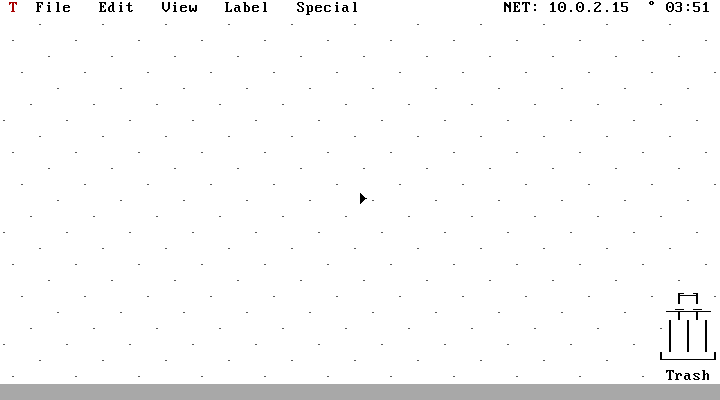<br>Desktop &amp; dock</td>
<td>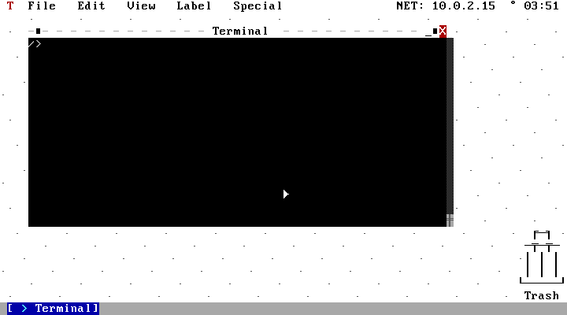<br>Terminal window</td>
</tr>
<tr>
<td>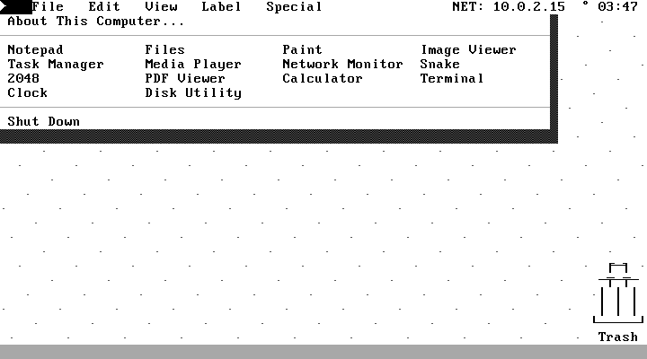<br>Special menu (app launcher)</td>
<td>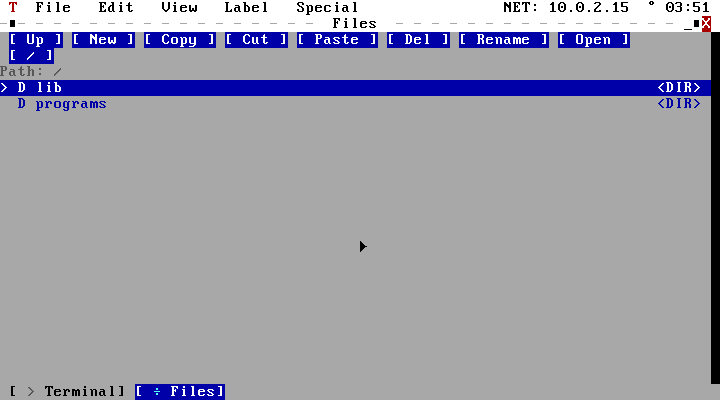<br>Files (file manager)</td>
</tr>
<tr>
<td>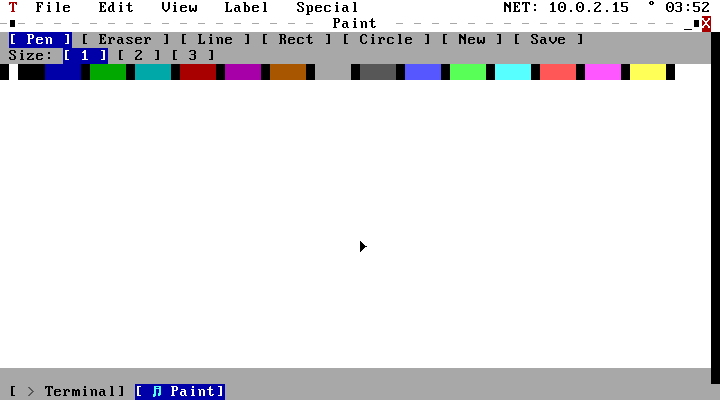<br>Paint</td>
<td>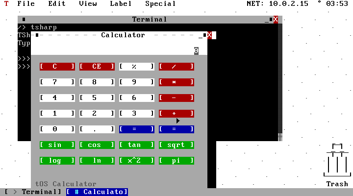<br>Calculator</td>
</tr>
<tr>
<td>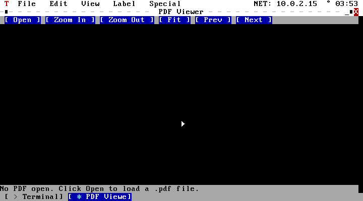<br>PDF Viewer</td>
<td>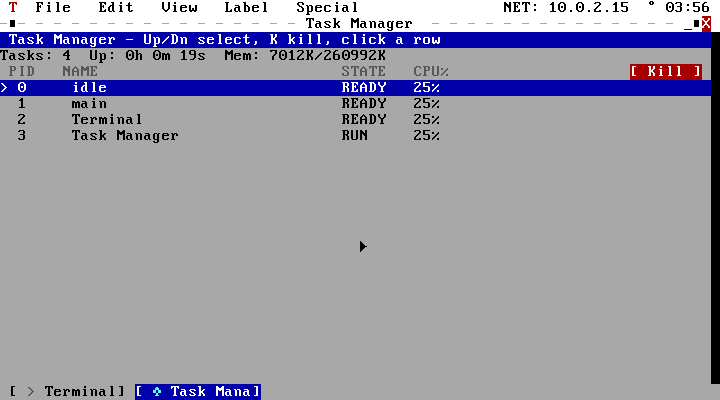<br>Task Manager</td>
</tr>
<tr>
<td>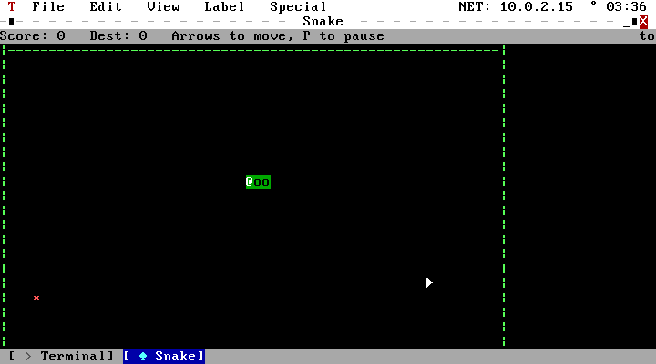<br>Snake</td>
<td>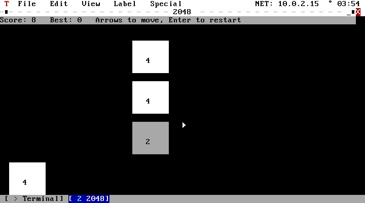<br>2048</td>
</tr>
<tr>
<td>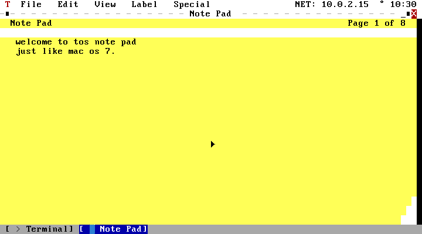<br>Note Pad (Mac OS 7 style)</td>
<td>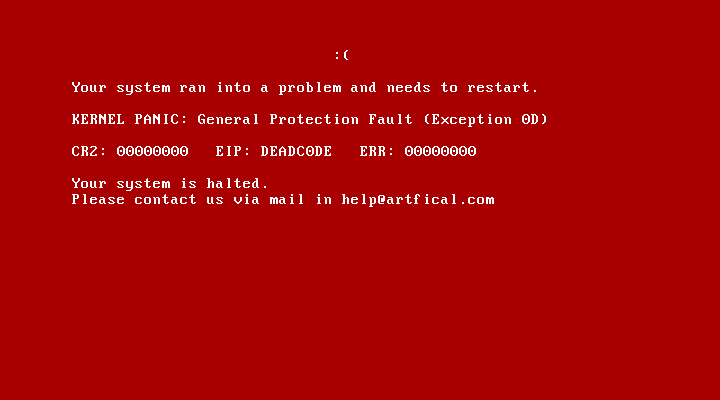<br>Crash screen (<code>crash</code> command)</td>
</tr>
<tr>
<td>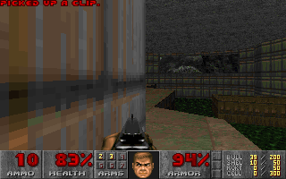<br>DOOM (shareware, <code>doom</code> command)</td>
<td><br>Bochs/VBE linear framebuffer test (<code>vgatest</code> command)</td>
</tr>
</table>

## System Requirements

- **CPU:** i586 compatible (32-bit x86)
- **Memory:** Minimum 32 MB recommended (3 MB absolute minimum)
- **Boot:** GRUB (Multiboot1 or Multiboot2, auto-detected) — bootable via ISO or PXE
- **Display:** VGA text mode (80x25), optional GUI mode with PS/2 mouse
- **Input:** PS/2 keyboard (mandatory), PS/2 mouse (optional)
- **Network:** RTL8139, PCnet (AMD Am79C970A/PCnet32), E1000, virtio-net, or NE2000 (RTL8029) NIC
- **Storage:** No disk required for boot — optional IDE disk for persistent storage via tFS
- **tFS:** [git.artfical.com/Artfical/tfs](https://git.artfical.com/Artfical/tfs) — custom persistent filesystem

## Building from Source

### Prerequisites

- GCC cross-compiler targeting i686-elf (or a 32-bit capable host GCC)
- GNU Make
- xorriso (for ISO generation)
- GRUB utilities (grub-mkrescue)

### Build Steps

```bash
git clone https://git.artfical.com/Artfical/tOS.git
cd tOS
make
```

The build produces `tOS.iso` in the project root.

### Running in QEMU

```bash
make run
```

Or manually:

```bash
qemu-system-i386 -cdrom tOS.iso -m 256
```

For networking (PCnet):

```bash
qemu-system-i386 -cdrom tOS.iso -m 256 -netdev user,id=net0 -device pcnet,netdev=net0
```

For audio — QEMU SB16:

```bash
make run-audio
# or manually:
qemu-system-x86_64 -cdrom tOS.iso -m 256M -soundhw sb16
```

For audio — VirtualBox (ICH AC97, auto-detected):

Enable **ICH AC97** in VirtualBox VM Settings → Audio → Audio Controller: ICH AC97. No extra flags needed; tOS auto-detects and uses ICH AC97 when SB16 is not present.

## Boot Process

1. GRUB loads the kernel at 0x200000 (2 MB) via Multiboot1 or Multiboot2 (the kernel detects which one was used from the magic value passed by the bootloader).
2. The kernel sets up the Global Descriptor Table (GDT) and Interrupt Descriptor Table (IDT).
3. Interrupt Service Routines (ISR) and IRQ handlers are installed for exceptions 0--31 and hardware IRQs 0--15.
4. Memory detection occurs via Multiboot information; a page bitmap is initialized and a kernel heap is carved out.
5. The initrd (if present) is imported into ramfs; otherwise an empty ramfs is used.
6. The Virtual Filesystem (VFS) layer is initialized and ramfs is mounted at `/`.
7. The PS/2 keyboard driver is initialized.
8. An optional GUI prompt is shown; if declined, the system boots in CLI mode.
9. System calls (int 0x80) are initialized.
10. Networking subsystems are initialized: NIC detection, ARP, IPv4/IPv6, ICMP/ICMPv6, UDP, UDP-Lite, TCP (RFC 793, 16-socket multi-connection), SCTP, DCCP, DNS, HTTP, HTTPS (TLS 1.2), IPsec, WireGuard tunnel. A link-local IPv6 address is derived from the MAC address (EUI-64).
11. The MicroPython runtime is initialized (128 KB GC heap, VM state, all modules registered).
12. The shell starts.

## Shell Commands

### File System

| Command | Description |
|---|---|
| `ls [path]` | List directory contents |
| `cd <path>` | Change current directory |
| `pwd` | Print current working directory |
| `mkdir <path>` | Create a directory |
| `rmdir <path>` | Remove an empty directory |
| `rm <path>` | Remove a file |
| `mv <src> <dst>` | Move or rename a file |
| `cp <src> <dst>` | Copy a file |
| `touch <path>` | Create an empty file |
| `cat <path>` | Display file contents |
| `head [-n N] <path>` | Show the first N lines of a file |
| `tail [-n N] <path>` | Show the last N lines of a file |
| `wc <path>` | Count lines, words, and characters |
| `sort <path>` | Sort lines of a file alphabetically |
| `grep <pattern> <path>...` | Search for a pattern in one or more files |
| `find <path>` | Find files in a directory tree |
| `rev <path>` | Reverse the characters of each line |
| `uniq <path>` | Filter out adjacent duplicate lines |
| `hexdump <path>` | Hex dump of a file |
| `tee <path>` | Write stdin to both terminal and file |
| `edit <path>` | Simple line-based text editor |
| `chmod <mode> <path>` | Change file permissions |
| `disk` | Manage disks (list/info/mount/umount/format) |
| `tar c\|x\|t <archive> ...` | Create/extract/list a ustar archive |
| `zip <archive> <file...>` | Create a zip archive |
| `unzip <archive> [dest]` | Extract a zip archive |

### System

| Command | Description |
|---|---|
| `man [command]` | Show the manual page for a command; without arguments lists all pages |
| `echo` | Echo arguments to the terminal |
| `clear` | Clear the terminal screen |
| `date` | Show the current date/time |
| `cal` | Show a calendar |
| `whoami` | Show the current user |
| `hostname` | Show the system hostname |
| `df` | Show filesystem disk usage |
| `free` | Show memory usage |
| `dmesg` | Show kernel log messages |
| `uptime` | Show system uptime |
| `ps` | List running processes |
| `htop` | Live process monitor |
| `kill <pid>` | Kill a process |
| `log` | Running tasks + full kernel/operation log |
| `yes [str]` | Print a string repeatedly |
| `seq [start] [step] <end>` | Print a sequence of numbers |
| `sleep <seconds>` | Delay for N seconds |
| `basename <path>` | Strip the directory from a path |
| `dirname <path>` | Strip the filename from a path |
| `which <cmd>` | Locate a command |
| `env` | Print environment variables |
| `alias [name=value]` | Set or list command aliases |
| `unalias <name>` | Remove a command alias |
| `history` | Show command history |
| `font` | List/change the terminal font style |
| `version` | Show kernel version |
| `beep [on\|off\|test]` | Toggle system UI sounds (window open/close, clicks) or fire a one-off test tone |
| `soundinfo` | Show which audio backend is active (or the vendor/device ID of an unsupported sound card, if any) |
| `vgatest` | Switch to a real pixel graphics mode via Bochs/VBE and draw a test pattern — see [Linear framebuffer graphics](#linear-framebuffer-graphics-work-in-progress) (returns to a working desktop on its own) |
| `doom` | Play the DOOM shareware episode — see [DOOM](#doom) (Ctrl+C returns to the desktop) |
| `3d` | Rotating filled/shaded/z-buffered cube — see [3D rasterizer](#3d-rasterizer-3d) (Escape or Ctrl+C returns to the desktop) |
| `crash` | Show the full-screen crash display with a made-up error, for demo purposes — press any key to return, nothing is actually wrong |
| `about` | About tOS |
| `uname` | System information |
| `reboot` | Reboot the system |
| `shutdown` | Halt the system |

### Scripting

| Command | Description |
|---|---|
| `tsharp [file]` | Run T# 4.1 Lite (interactive or from file) |
| `python [file]` | Enter the MicroPython REPL or run a `.py` file |

### Networking

| Command | Description |
|---|---|
| `ping <host>` | ICMP ping (IPv4) — hostname or dotted-decimal IP |
| `ping6 <addr>` | ICMPv6 Echo Request/Reply (IPv6) |
| `ip6addr` | Show the kernel's link-local IPv6 address |
| `wget <url>` | Download a file over HTTP/1.0 (port 80) |
| `wget https://<url>` | Download a file over HTTPS (TLS 1.2, port 443) |
| `sctp_connect <ip> <port>` | Open an SCTP association (blocking handshake) |
| `sctp_send <data>` | Send a DATA chunk on the current SCTP association |
| `sctp_close` | Close the current SCTP association (SHUTDOWN sequence) |
| `dccp_connect <ip> <port>` | Open a DCCP connection (REQUEST/RESPONSE handshake) |
| `dccp_send <data>` | Send a DCCP DATA datagram |
| `udplite_send <ip> <port> <data> [coverage]` | Send a UDP-Lite datagram; `coverage` = bytes covered by checksum (0 = full, 8 = header only) |
| `ipsec_sa` | Dump the IPsec Security Association (SA) table |
| `vlan add <vid>` | Register a VLAN ID in the ingress allow list |
| `vlan rm <vid>` | Remove a VLAN ID from the allow list |
| `vlan list` | Show all registered VLANs |
| `bridge create <name>` | Create a software bridge |
| `bridge del <name>` | Delete a bridge |
| `bridge addif <br> <if>` | Add a member interface to a bridge |
| `bridge delif <br> <if>` | Remove a member interface from a bridge |
| `bridge list` | Show all bridges and the FDB |
| `bond create <name> [failover\|balance]` | Create a link aggregation bond |
| `bond del <name>` | Delete a bond |
| `bond addif <bond> <if>` | Add a slave interface to a bond |
| `bond delif <bond> <if>` | Remove a slave from a bond |
| `bond failover <name>` | Manually trigger failover to the next slave |
| `bond list` | Show all bonds and active slave |
| `ipx send <node12hex> <data>` | Send an IPX datagram to a node (12-char hex MAC) |
| `route show` | Display the routing table |
| `route add <dst/pfx> <gw> [metric] [table]` | Add a static route |
| `route del <dst/pfx> [table]` | Delete a route |
| `policy show` | Display policy routing rules |
| `policy add <src/pfx> <dst/pfx> <table> <prio>` | Add a policy rule |
| `policy del <prio>` | Delete a policy rule by priority |
| `fw rule add <proto> <src/pfx> <dst/pfx> [dport] <ACCEPT\|DROP\|REJECT>` | Add a firewall rule |
| `fw rule del <idx>` | Delete a firewall rule |
| `fw rule list` | List firewall rules |
| `fw nat add SNAT\|DNAT <match/pfx> [port] <new_ip> [new_port]` | Add a NAT rule |
| `fw nat del <idx>` | Delete a NAT rule |
| `fw nat list` | List NAT rules |
| `fw ct` | Dump the connection tracking table |
| `gre add <local> <remote> [key_hex]` | Create a GRE tunnel |
| `gre del <idx>` | Delete a GRE tunnel |
| `gre list` | List GRE tunnels |
| `ipip add <local> <remote>` | Create an IP-in-IP tunnel |
| `ipip del <idx>` | Delete an IP-in-IP tunnel |
| `ipip list` | List IP-in-IP tunnels |
| `wg add <remote_ip> <rport> <lport> <psk_hex64> <peer_id_hex>` | Create a WireGuard-like encrypted tunnel |
| `wg del <idx>` | Delete a WG tunnel |
| `wg list` | List WG tunnels |

## Filesystem

tOS boots with two filesystems active by default, and can mount several more on demand:

- **ramfs** — Memory-resident filesystem mounted at `/`. Volatile — all data is lost on reboot.
- **tFS** — Persistent on-disk filesystem mounted at `/mnt` when an IDE disk is detected. Built on a custom on-disk format with 4 KB blocks, bitmap-based allocation, inline data for small files, and indirect/double-indirect block pointers.

At first boot with a blank IDE disk, an interactive installer (Turkish UI) formats the disk and copies system files. On subsequent boots, tFS is auto-detected and mounted.

### Mountable Disk Filesystems

The `disk` shell command can probe, mount, and format the following on-disk filesystems on any detected block device (IDE, AHCI, NVMe, or USB mass storage), all with full read/write support through the VFS layer:

| Filesystem | File | Notes |
|---|---|---|
| FAT16 | `fat16.c` | |
| FAT32 | `fat32.c` | |
| exFAT | `exfat.c` | |
| ext2 | `ext2.c` | |
| ext3 | `ext3.c` | Journaling |
| ext4 | `ext4.c` | Extents |
| NTFS | `ntfs.c` | |
| **Btrfs** | `btrfs.c` | B-tree leaf, inline + regular extents, CRC32 checksums |
| **XFS** | `xfs.c` | Shortform dirs, B-tree extents |

Use `disk list` to see detected block devices, `disk mount <device> <mountpoint> <fstype>` to mount one, and `disk format <device> <fstype>` to format it. The graphical Disk Manager app (see [GUI Mode](#gui-mode)) exposes the same operations visually.

> **tFS source:** [git.artfical.com/Artfical/tfs](https://git.artfical.com/Artfical/tfs)

## Networking

The network stack is implemented from scratch in `kernel/net/`. It supports both IPv4 and IPv6 and spans the following protocols:

### IPv4 Stack

| Protocol | File | Description |
|---|---|---|
| **ARP** | `arp.c` | Address Resolution Protocol; 16-entry cache |
| **IP** | `ip.c` | Internet Protocol (no fragmentation), dispatches to all transport protocols |
| **ICMP** | `icmp.c` | Echo Request/Reply (`ping`) |
| **UDP** | `udp.c` | User Datagram Protocol; 4-socket receive table |
| **TCP** | `tcp.c` | Transmission Control Protocol — RFC 793 state machine, 16 concurrent sockets, retransmission, slow-start congestion control |
| **DNS** | `dns.c` | A-record resolution |
| **HTTP** | `http.c` | HTTP/1.0 client (`http_get`) |
| **HTTPS** | `https.c` | HTTPS client over TLS 1.2 — AES-128-CBC-SHA256, RSA-2048 key exchange, no cert verification |
| **TLS 1.2** | `tls.c` | Minimal TLS 1.2 client — ClientHello/ServerHello, Certificate parse, ClientKeyExchange (RSA PKCS#1 v1.5), Finished verify, AES-128-CBC record encryption |
| **SHA-256** | `sha256.c` | SHA-256 + HMAC-SHA256 (used by TLS PRF and record MAC) |
| **AES-128** | `aes.c` | AES-128 encrypt/decrypt (used by TLS CBC mode) |
| **SCTP** | `sctp.c` | Stream Control Transmission Protocol (RFC 4960) |
| **DCCP** | `dccp.c` | Datagram Congestion Control Protocol (RFC 4340) |
| **UDP-Lite** | `udplite.c` | Partial-checksum UDP (RFC 3828) |
| **IPsec AH** | `ipsec.c` | Authentication Header (RFC 4302): parse, replay detection, inner payload re-injection |
| **IPsec ESP** | `ipsec.c` | Encapsulating Security Payload (RFC 4303): parse + SA tracking (decryption requires IKE) |

### Routing & Filtering

| Feature | File | Description |
|---|---|---|
| **Routing Table** | `route.c` | Static routing; 32-entry table; longest-prefix match; 8 independent routing tables (table 0 = main) |
| **Policy Routing** | `route.c` | Up to 8 policy rules matching src/dst prefix → select routing table; evaluated by priority |
| **Firewall** | `fw.c` | Stateful packet filtering; ACCEPT / DROP / REJECT actions; first-match rule list (up to 32 rules) |
| **Connection Tracking** | `fw.c` | 64-entry conntrack table; auto-populated on every rx/tx; used by NAT for translation state |
| **SNAT / DNAT** | `fw.c` | Source and destination NAT; IP and port rewriting; checksum update on modification |

### VPN & Tunnelling

| Feature | File | Description |
|---|---|---|
| **GRE** | `gre.c` | Generic Routing Encapsulation (RFC 2784); proto 47; optional key field; inner IPv4 re-injected into ip_handle() |
| **IP-in-IP** | `ipip.c` | IP encapsulation (RFC 2003); proto 4; minimal outer-header tunnel |
| **WG-like tunnel** | `wgtun.c` | WireGuard-inspired pre-shared-key UDP tunnel (port 51820); XChaCha20-Poly1305 AEAD; 24-byte nonce counter; MAC verified before inner packet re-injection |
| **XChaCha20-Poly1305** | `chacha20.c` | From-scratch implementation; ChaCha20 20-round block, HChaCha20 sub-key derivation, Poly1305 RFC 8439 MAC; no libm/libc |

### Link Layer Extensions

| Feature | File | Description |
|---|---|---|
| **VLAN (802.1Q)** | `vlan.c` | Tag strip/insert in `net_poll()`; per-VID ingress allow list (up to 16 VIDs); PCP field preserved on egress |
| **Bridge** | `bridge.c` | Software bridge (br0-style); up to 4 bridges × 4 ports; 16-entry FDB with source-MAC learning; `bridge_rx()` called on every ingress frame |
| **Bonding** | `bonding.c` | Link aggregation; failover (active-backup) and balance (round-robin TX) modes; up to 4 bonds × 4 slaves; `bond_failover()` advances active slave |
| **IPX** | `ipx.c` | Internetwork Packet Exchange (EtherType 0x8137); 30-byte header; echo service; historical/educational reference |

### IPv6 Stack

| Protocol | File | Description |
|---|---|---|
| **IPv6** | `ip6.c` | 40-byte fixed header; link-local address auto-configured from MAC (EUI-64) at boot |
| **ICMPv6** | `icmpv6.c` | Echo Request/Reply (`ping6`), Neighbor Solicitation/Advertisement (NDP — IPv6 equivalent of ARP) |

### SCTP Details

SCTP (`kernel/net/sctp.c`) implements a full association finite state machine:

- CRC32c checksum (Castagnoli polynomial, RFC 4960 §6.8)
- INIT → INIT-ACK → COOKIE-ECHO → COOKIE-ACK handshake (client side)
- DATA chunks with TSN, stream ID, and fragment flags
- SACK acknowledgement
- HEARTBEAT / HEARTBEAT-ACK echo
- SHUTDOWN / SHUTDOWN-ACK / SHUTDOWN-COMPLETE sequence
- ABORT handling

API: `sctp_connect(ip, port)` / `sctp_send(data, len)` / `sctp_recv(buf, max)` / `sctp_close()`

### DCCP Details

DCCP (`kernel/net/dccp.c`) implements the basic OPEN state:

- Short-sequence header (X=0, 12 bytes), pseudo-header checksum
- REQUEST → RESPONSE → ACK handshake
- DATA / DATAACK / ACK exchange
- CLOSE / RESET

API: `dccp_connect(ip, port)` / `dccp_send(data, len)` / `dccp_recv(buf, max)` / `dccp_close()`

### UDP-Lite Details

UDP-Lite (`kernel/net/udplite.c`) uses the same header layout as UDP but reinterprets the `length` field as `checksum_coverage` (RFC 3828 §3.1):

- `coverage = 0` → checksum covers the full datagram
- `coverage = 8` → only the 8-byte header is checksummed (payload is unprotected)
- Values 1–7 are normalised to 8 (RFC requirement)

### IPsec Details

IPsec (`kernel/net/ipsec.c`) handles inbound AH and ESP packets:

**AH (proto 51):** Parses the `next_header`, `payload_len`, SPI, and sequence number. Performs replay detection against the per-SA sequence counter. Reconstructs a synthetic IP header with `next_header` as the protocol, then re-injects the inner payload into `ip_handle()` so it is dispatched normally.

**ESP (proto 50):** Parses SPI and sequence number. Performs replay detection. Logs the encrypted payload (decryption is algorithm-specific and requires key material from IKE — not implemented). SA entries can be added manually with `ipsec_sa_add()` or are auto-learned from inbound packets.

Both AH and ESP maintain a global Security Association table (`ipsec_sa_table[8]`) accessible from the shell with `ipsec_sa`.

### ICMPv6 / NDP Details

ICMPv6 (`kernel/net/icmpv6.c`) handles:

- **Echo Request (type 128) / Echo Reply (type 129):** `ping6` sends an Echo Request and polls for the matching Reply.
- **Neighbor Solicitation (type 135):** NDP resolution — equivalent to ARP for IPv6. Sends a solicited-node multicast NS; extracts the MAC from the Target Link-Layer Address option in the response.
- **Neighbor Advertisement (type 136):** Responds to NS messages directed at our link-local address; includes our MAC in the Target Link-Layer Address option.

NDP results are stored in an 8-entry NDP cache. Unknown targets fall back to the solicited-node multicast MAC `33:33:ff:xx:xx:xx`.

### Timing & Reliability

Every blocking network call (`arp_resolve`, `dns_resolve`, `icmp_ping`, `tcp_connect2`) waits against a **wall-clock deadline**, not a fixed retry-count loop — how long a single `nic_poll()` call takes varies enormously across NIC drivers and hypervisors, so a fixed iteration count is either too short on a slow one or a multi-minute hang on a very slow one. The clock backing these deadlines (`debugmon_uptime_ms()` in `kernel/core/debugmon.c`) is TSC-based: the CPU's free-running cycle counter is calibrated once at boot against ~200ms of genuine PIT ticks (while IDT gate 32 still only carries real hardware IRQ0, before `scheduler_init()` reinstalls that vector for `task_yield()`'s software self-yields), after which elapsed wall-clock time is pure arithmetic — immune to how many times a busy loop calls `task_yield()`.

The UDP and ICMP checksum functions (`udp.c`, `icmp.c`) correctly fold a trailing odd byte into the *high* byte of the final 16-bit word per the standard Internet checksum algorithm (this silently corrupted almost every DNS query for a while, since hostnames almost always produce an odd-length UDP payload — even-length ICMP echo payloads never exercised the bug). `tcp.c`'s `send_seg()` resolves the next hop through the routing table (`route_lookup()`) rather than ARPing the connection's final destination IP directly, so TCP can actually reach hosts outside the local subnet — `ip.c`/`gre.c`/`ipip.c` already did this; TCP was the one path that didn't.

### NIC Drivers

Five NIC drivers are available, all auto-detected via PCI bus scanning:

| Driver | File | Device |
|---|---|---|
| RTL8139 | `rtl8139.c` | Realtek Fast Ethernet |
| PCnet | `pcnet.c` | AMD PCnet32 / Am79C970A (QEMU default) |
| E1000 | `e1000.c` | Intel PRO/1000 |
| virtio-net | `virtio_net.c` | VirtIO paravirtualized NIC |
| NE2000 | `ne2000.c` | Realtek RTL8029 / NE2000 PCI clone |

## Multitasking

The scheduler uses the PIT (Programmable Interval Timer) at approximately 100 Hz. Tasks are scheduled in a round-robin fashion. The scheduler supports:

- Task spawning (`task_spawn`)
- Cooperative and preemptive yields (`task_yield`)
- Task sleep (`task_sleep`)
- Task exit (`task_exit`)
- Dedicated timer interrupt handler with stack switching

## Memory Allocator

`kernel/lib/memory.c` implements a first-fit, singly-linked free-list `malloc`/`free`/`krealloc` over a growable heap region, hardened against corruption:

- Every pointer the allocator follows — a `next` link in the free list, or the header implied by a pointer passed to `free()`/`krealloc()` — is bounds- and alignment-checked before being dereferenced, so a corrupted link produces a reported, contained failure instead of an unchecked read that can page-fault anywhere in the kernel.
- A 4-byte canary word follows every allocated block's payload and is checked on `free()`: writing even one byte past what was requested now prints a "buffer overflow detected" diagnostic instead of silently corrupting the next block's header (which used to surface, if at all, as an unrelated crash far away from the actual bug).
- `free()` also detects and reports double-frees and frees of non-heap pointers, rather than acting on whatever a garbage header field happens to contain.
- A corrupted free-list is reported once and the allocator falls back to growing the heap rather than crashing, so a single corruption event degrades gracefully instead of taking the whole system down.

The corruption this hardening was built to survive was root-caused, not just contained: it was the E1000 NIC driver's own DMA receive buffers (`kernel/net/e1000.c`) getting written past their 2048-byte allocation by the emulated NIC's DMA engine — confirmed with an A/B test (`-net none` reproduced it zero times across 6 runs of a script that reliably corrupted the heap with networking on). Since the overwrite happens below the C driver, `e1000.c` now over-allocates RX buffers with 128 bytes of unadvertised padding and clamps the hardware-reported receive length to the real buffer size before trusting it.

The other NIC drivers with a heap-allocated DMA target got the same audit: **`rtl8139.c` had a real, independently reproducible instance of the same bug class** — its single circular RX buffer only padded 16 bytes past its nominal size, nowhere near enough for the RTL8139's documented behavior of writing a frame that starts near the ring's end out past that boundary in one contiguous run rather than wrapping mid-packet; raised to 1536 bytes of padding plus a read-side clamp. `pcnet.c` and `virtio_net.c` had the same risk shape (trusting a hardware/device-reported length with zero margin) and got the same padding+clamp treatment; `virtio_net.c` also gained a missing bounds check on the device-reported descriptor index. `ne2000.c` uses I/O-port-mediated reads straight into an already-bounded caller buffer rather than DMA-ing into a heap target, and was already safe. Full write-up in `HEAP_DEBUG_LOG.md`.

## GUI Mode

At boot, the user is prompted to enter GUI mode. When enabled, a window manager (`kernel/display/wm.c`) takes over:

- A title bar and a taskbar/dock with app icons are drawn.
- The terminal runs in its own movable, focusable window below the title bar.
- A mouse cursor is rendered and tracks PS/2 mouse movement (with IntelliMouse wheel support auto-detected at boot); windows can be dragged by their title bar, resized from the bottom-right corner, focused, and minimized.
- The GUI polls mouse and keyboard events in the shell loop.
- Right-clicking empty desktop space opens a context menu: New Folder, New File (opens straight into Notepad), Open Files, Open Terminal, About This Computer, Change Background (cycles through a few flat colors, or clears an active wallpaper back to them), and Refresh Desktop.
- **Wallpaper**: pick a `.png` in Files and press `W` to set it as the desktop wallpaper (the image is quantized down to one of the 16 VGA colors per desktop cell, same as the Image Viewer). In Paint, pressing `W` sets the *current canvas* as the wallpaper directly — no need to save it to a file first.
- Opening/closing a window and clicking a menu item or dock icon each play a short UI sound — see [System Sounds](#system-sounds).

Several built-in GUI applications are launchable from the dock:

- **Notepad** (`notepad.c`) — text editor window (up to 1000 lines, with a scrollbar), can open/save files on any mounted filesystem, with Find (Ctrl+F), Replace All (Ctrl+R), Go to Line (Ctrl+G), and text selection (Shift+arrows, including across lines) with Copy/Cut/Paste (Ctrl+C/X/V). Shows line numbers in a gutter, and applies syntax highlighting (keywords, strings, numbers, comments, preprocessor directives) when editing `.c`/`.h`/`.cpp` files.
- **Clock** (`clock.c`) — analog/digital clock
- **Calculator** (`calculator.c`) — basic operations plus scientific row: sin/cos/tan, sqrt, log/ln, x², and π, backed by from-scratch Newton's-method/Taylor-series math (no libm in this freestanding kernel)
- **Disk Manager** (`diskmgr.c`) — view and manage attached disks; every mount/unmount/format goes through `diskops.c`, which logs a start line, a result line, and — for format — a hex dump of sector 0 read back from disk afterward, all readable with the `log` shell command
- **Files** (`filemgr.c`) — graphical file manager with full mouse support: browse, copy/cut/paste, delete, rename, create folders, open files directly in Notepad or the Image Viewer, and switch between mounted filesystems (ramfs, tFS, FAT16/32, exFAT, ext2/3/4, NTFS, Btrfs, XFS) via a one-click disk bar. Supports multi-select (Ctrl+click to toggle individual files, Shift+click or Shift+arrows for a range) for bulk copy/cut/delete. Deleting moves items to `/trash` (a Recycle Bin) instead of erasing them outright — press `T` to jump straight to it; restore a file with Cut/Paste like any other folder, or select it and press Delete again while inside `/trash` to erase it for good.
- **Paint** (`paint.c`) — mouse-driven drawing app: pen, eraser, and line/rectangle/circle shape tools (click-drag previews the shape live, release to commit it), 3 brush sizes, a 16-color VGA palette, and a "Save" that exports the canvas as a real, standard PNG file (cell grid rasterized to RGB pixels through a from-scratch PNG/zlib encoder)
- **Image Viewer** (`viewer.c`) — opens real PNG files (decoded through a from-scratch INFLATE/DEFLATE + PNG decoder in `png.c`, supporting stored/fixed/dynamic Huffman blocks and grayscale/RGB/palette/RGBA color types), downsampled and quantized to the nearest of the 16 VGA colors for display, with zoom in/out/fit and arrow-key panning.
- **Task Manager** (`taskmgr.c`) — live process list (scheduler state, uptime, memory usage), select a task with the mouse or arrow keys and kill it with a confirm prompt; refuses to kill the idle task or itself
- **Media Player** (`mediaplayer.c`) — WAV/MP3/AAC/M4A audio player with seek bar, volume control, playlist browser, and loop mode. Opens via the Special menu or `open mediaplayer`. Plays the built-in original demo melody automatically on first launch (no external files needed). See [Audio](#audio) section for hardware requirements.
- **Network Monitor** (`netmon.c`) — live network stack inspector with four tabs (Interfaces, Connections, Routes, Firewall): NIC driver/stats, active TCP/UDP/SCTP sockets, the routing table, and firewall rules, plus a live RX/TX packets-per-second bar chart. Opens via the Special menu or `open netmon`.
- **Snake** (`snake.c`) — classic arcade game: arrow keys to steer, speeds up as your score climbs, P to pause, Enter to restart after a game over. Tracks a best-score high watermark for the session. Opens via the Special menu or `open snake`.
- **2048** (`game2048.c`) — classic sliding-tile puzzle on a 4x4 grid: arrow keys slide and merge tiles, each color-coded by value, Enter restarts anytime. Tracks a best-score high watermark for the session. Opens via the Special menu or `open 2048`.
- **PDF Viewer** (`pdfview.c`, backed by a from-scratch reader in `pdf_parse.c`) — opens real PDF files: page text is rendered to the canvas with pan (arrow keys or click-drag toolbar), Zoom In/Out, Fit, Prev/Next page (`[`/`]`), and text search (`Ctrl+F` prompts for a term; `Ctrl+F`/`N` again jumps to the next match, highlighted and wrapping across pages). The reader finds objects by scanning for `N G obj`/`endobj` pairs rather than parsing the xref table, decompresses `FlateDecode` content streams (reusing the same DEFLATE inflater as the PNG decoder), and interprets the text-showing subset of content-stream operators (`Tf`, `Td`/`TD`/`Tm`/`T*`, `Tj`/`TJ` and the quote-mark show operators) to place text. It does not render vector graphics/images or map embedded font glyph encodings, so pages are shown as extracted text at approximately their real position/size rather than a pixel-perfect rasterization. Opens via the Special menu, `open pdf`, or double-clicking a `.pdf` in Files.
- **Note Pad** (`stickynotes.c`) — a homage to the classic Mac OS 7 Note Pad desk accessory: a fixed 8-page yellow pad (one page visible at a time), with the same folded-corner "dog-ear" in the bottom-right corner to click through to the next page — no keyboard shortcut for that, just like the original. Autosaves every keystroke to `/.stickynotes`, so notes are always there next boot with no explicit save step. Opens via the Special menu or `open notes`.
- **About** (`about.c`) — system information window

## Linear framebuffer graphics (work in progress)

The GUI above is entirely VGA text mode (80x25 character cells) —
tOS has no real pixel graphics yet, which is a hard requirement for
things like a DOOM port. First step towards that: `kernel/drivers/video/bochs.c`
now drives the Bochs/QEMU VBE display interface (the `bochs-display`/`std-vga`
PCI device, vendor `0x1234` device `0x1111`) to switch into a real linear
framebuffer mode (e.g. 320x200x32bpp) and plot pixels directly.

Try it with the `vgatest` shell command: switches into graphics mode,
draws a gradient with a crosshair, waits for a key, then returns to
the desktop.

Cleanly returning to VGA text mode after using graphics mode used to
be a long-standing, previously-unsolved problem here (documented for a
while as "geometry restores fine, but characters come back as
static-like noise"). Three separate, compounding bugs turned out to be
involved, all in `kernel/drivers/video/vga.c`/`vga_font.c`:
- The text-mode CRTC/Sequencer/Graphics Controller register *capture*
  taken before ever touching Bochs/VBE was itself unreliable to round-
  trip on both QEMU and VirtualBox (not just the Attribute Controller
  block, which was already known and worked around). Replaced with a
  fully hardcoded, standard mode 0x03 (80x25 text) register table
  instead of trusting any live capture -- the same approach already
  used for mode 0x13 (320x200x256) on the graphics side.
- The DAC's 256-entry RGB color table (ports 0x3C7/0x3C8/0x3C9) was
  never restored at all -- it's separate hardware state from every
  register block above (the Attribute Controller only *selects* a DAC
  entry, it doesn't hold RGB values), and Bochs/VBE's 32bpp linear
  framebuffer modes evidently leave it in some non-standard state.
  Fixed by writing the standard, well-known 16-color VGA palette
  values directly (same "use fixed values, not a live capture"
  approach as above).
- The character glyph bitmaps in VGA plane 2 don't survive a Bochs/VBE
  session intact either -- and reloading them turned up a real,
  previously-unnoticed bug in `vga_font.c` (used for Turkish keyboard
  layout glyph patches and the `font` command's styles): its plane-2
  read/write helper only cleared the Graphics Controller's "Read Mode"
  bit, not its "Host Odd/Even" bit, so Odd/Even addressing stayed
  active and silently overrode the plane selection -- every "font
  capture" was actually reading back ordinary interleaved character+
  attribute bytes from whatever was on screen at the time, not real
  glyph data. Once both bits are cleared, capturing the real
  BIOS/GRUB-loaded font once at boot (before anything can touch VBE)
  and reloading it after every text-mode restore fixes the actual
  displayed content, not just the registers around it.

With all three fixed, `vgatest` now returns to a fully working,
readable desktop from the CLI shell -- no more `reboot` needed.

Fixing the plane-2 addressing above surfaced a second, unrelated
`vga_font.c` bug -- one that had nothing to do with DOOM/vgatest/3d at
all, and instead affected the TR-Q keyboard layout on every single
boot, corrupting seemingly-random letters everywhere (confirmed via
serial log that the underlying text itself was always correct --
purely a font rendering problem). Captured several consecutive
letters' glyph bitmaps and found every *other* one came back all
zero, in a perfectly alternating pattern by character code (`k`/`m`/
`o`/`q` blank, `l`/`n`/`p`/`r` fine) -- each character's slot in the
VGA character generator's plane-2 memory is actually 32 bytes wide,
even though an 8x16 font only uses the first 16 of them, and
`font_read()`/`font_write()`'s copy loop had always assumed a flat
16-byte stride. Harmless for the US layout (which never calls
`font_write()` unless something explicitly changes font style) and
invisible before this session's fixes (reading *and* writing with the
same wrong assumption round-trips losslessly for a plain unmodified
copy), but real once `vga_font_load_turkish()`'s Turkish glyph patches
-- or a real style change -- get involved. Fixed by making the
`FONT_ADDR`-facing copy loops address memory at a 32-byte stride per
character while keeping the in-RAM cache buffers a compact 16-bytes-
per-glyph array internally.

**Known remaining issue, low priority:** `font 7` (the "outline"
style) renders as barely-visible scattered dots instead of readable
text. This is unrelated to the stride bug above (every other style,
including ones that transform the base glyph just as heavily like
"bold" or "shadow", renders correctly with the same, now-verified-
correct base font data) — it's specifically `apply_style()`'s case 7
bit-logic (`row & ~(row << 1) & ~(row >> 1)`, meant to keep only each
row's edge pixels) being too aggressive: most glyph rows in an 8x16
font are thick enough that nearly every set bit has a same-row
neighbor, so nearly everything gets zeroed out. Not fixed here —
cosmetic, opt-in only (nobody hits this without deliberately running
`font 7`/`font outline`), and orthogonal to everything else in this
section.

A fourth issue only showed up in GUI mode: closing windowed DOOM (or
returning from `vgatest`/`3d` while the desktop is running) could
flicker between correct and garbled, worse than the plain CLI shell
ever showed. GUI mode's desktop task keeps repainting `0xB8000` on
every preemptive timer tick regardless of what any other task is
doing, and none of the VGA register writes above -- nor
`vga_font.c`'s plane-2 font read/write, which briefly reprograms the
same registers to address plane 2 instead -- disabled interrupts
around themselves. A timer interrupt landing mid-sequence could switch
to the desktop repaint task, whose writes would land in the wrong
place (font memory instead of the text plane, or vice versa) since the
hardware was mid-reconfiguration at that exact moment. Both
`vga_set_mode()` and `vga_font.c`'s `font_read()`/`font_write()` now
hold interrupts off across their entire register-reprogram/copy/
restore sequence, using `pushfl`/`popfl` rather than a bare `cli`/`sti`
pair so they nest safely (`vga_set_mode()` calls into the font reload,
which does its own interrupt-disable internally).

## DOOM

tOS can run the DOOM shareware episode two ways. `kernel/doom/` vendors
[doomgeneric](https://github.com/ozkl/doomgeneric)'s engine source
(GPLv2 — see `kernel/doom/LICENSE` and `kernel/doom/README.md` for
full licensing details, including the freely-distributable shareware
`assets/doom1.wad` bundled in the disk image); `kernel/doom/port/` is
tOS's own platform glue (framebuffer blit, keyboard input, timing).

- **`doom` shell command** — fullscreen, using the real Bochs/VBE
  linear framebuffer above as its display (actual pixel graphics, the
  same resolution DOOM renders internally). Press Ctrl+C to return to
  the desktop: `doomgeneric_tos_run()`'s loop watches for it and does
  the same `bochs_disable()` + `vga_set_mode(VGA_MODE_TEXT)` restore
  `cmd_vgatest` uses before returning to the shell, so `reboot` is no
  longer needed here either.
- **"DOOM" from the T menu, or `uygulamaac("doom")`/`open("doom")`
  from a script** — opens from the desktop like any other app, but
  renders through the exact same real Bochs/VBE pixel path as the
  `doom` command (`DG_Init()`/`DG_DrawFrame()` in
  `kernel/doom/port/doomgeneric_tos.c` don't distinguish between the
  two at all — no blocky text-cell downsampling). Since the hardware
  can only be in one video mode at a time, the desktop's own VGA text
  mode is unavoidably replaced by DOOM's graphics mode while it's
  running. Two ways back: closing the window from the dock/taskbar
  (`kernel/display/wm.c`'s `wm_close_window()` calls `bochs_disable()`
  + `vga_set_mode(VGA_MODE_TEXT)` for a `WIN_KIND_DOOM` window before
  killing its task), or pressing Ctrl+C from inside DOOM itself, which
  now does the exact same thing from the other direction: it calls
  `wm_kill_task_window(task_get_pid())` (the same helper
  `wm_close_window()` uses internally, and the one Task Manager already
  uses to kill an arbitrary window's task from outside) on itself, then
  spins on `task_yield()` forever rather than returning -- a window
  task is spawned via `task_spawn()`, whose stack (see scheduler.c's
  `setup_task_stack()`) has no valid return address for the entry
  function to `ret` into, so letting `doomgeneric_tos_run()` return
  normally here (the way the CLI `doom` command's Ctrl+C does) would
  crash. Either way, no `reboot` is needed.

Ctrl+C detection originally polled `keyboard_data_available()` /
`keyboard_getchar()` once per outer-loop iteration, but that turned out
unreliable in practice (confirmed not working even in the CLI `doom`
command, which has no windowing/focus concept at all) — likely because
`keyboard_getchar()` only ever returns a buffered character while
`wm_current_task_has_focus()` is true, so a single unlucky timing
window (or another hypervisor-dependent timing quirk, the same general
class already documented elsewhere in this project) could leave it
polling long after the key was actually pressed. Switched to
`kernel/drivers/input/keyboard.c`'s existing `interrupt_char`/
`interrupt_callback` hook instead (already used by MicroPython's REPL
for its own Ctrl+C) — it fires synchronously from inside the keyboard
IRQ handler itself the instant Ctrl+C is pressed, independent of
whatever `doomgeneric_Tick()`/the render loop happens to be doing at
that moment. The handler only sets a flag; the actual video-mode
restore and task cleanup still happens from normal task context in the
main loop, since that's not necessarily safe to do directly from
inside an IRQ.

Getting this running surfaced and fixed several real, previously
unnoticed bugs elsewhere in the kernel, all independent of DOOM
itself:
- `printf()`/`vsnprintf()` didn't support precision on `%d` (e.g.
  `%.3d` for zero-padding) or `%s` (max-length truncation) — silently
  printed the literal format text instead. Now implemented in
  `kernel/lib/stdio.c`.
- `printf()` double-wrote every character to the serial log (both
  directly and via `terminal_putchar()`, which already mirrors to
  serial itself) — never noticed since almost nothing else in this
  codebase uses `printf()` for output.
- The kernel heap could never grow to satisfy a single allocation
  larger than ~1MB, no matter how high its configured maximum was —
  each failed `malloc()` only grew the heap by one fixed 1MB step
  before immediately re-checking whether that was enough. Fixed to
  grow by as many steps as the request actually needs.
- **The most serious one:** `memory_init()` picked where the heap
  starts based only on the kernel binary's own end address, with no
  idea that the initrd module (loaded separately by GRUB, holding
  every bundled file including the WAD) occupies its own chunk of
  physical memory nearby. Once a single allocation was both large
  enough and early enough (DOOM's ~4MB WAD, imported at boot), the
  heap grew straight into the initrd's own memory and silently
  corrupted the *not-yet-imported* tail of the exact file being
  imported, while `ramfs_import_initrd()` was still reading from that
  same physical memory. Fixed by having the heap start after
  whichever is later: the kernel's own end, or the initrd module's end.
- tOS's keyboard driver only ever tracked key *presses*, never
  releases (`if (scancode & 0x80) return;` silently dropped every
  break code) — fine for line-editing and menus, but DOOM's platform
  layer needs to know when a key is released too (to stop moving,
  stop firing, etc). Added a small raw press/release event queue
  (`keyboard_get_raw_event()`) alongside the existing press-only one,
  without touching any existing caller's behavior.

### Sound

`kernel/doom/port/i_sound_tos.c` implements the `sound_module_t`
interface `kernel/doom/i_sound.c` expects from a platform backend
(`DG_sound_module`, gated behind `FEATURE_SOUND`, now defined in the
Makefile's `DOOM_CFLAGS`) by driving tOS's own `kernel/audio/audio.c`
mixer directly — the same one the media player and demo song already
use — instead of SDL_mixer. `kernel/doom/port/SDL_mixer.h` is an empty
stub header: the vendored `i_sound.c` unconditionally `#include`s
`<SDL_mixer.h>` whenever `FEATURE_SOUND` is defined, but (checked
before enabling it) never actually calls any `Mix_*()` function in
that file, so the include just needs to resolve to *something*.

DOOM's own sound effect lumps are already in the exact 8-bit
unsigned mono PCM format `audio.c`'s `audio_submit()` expects (the
DMX sound format's 8-byte header is `format:u16, sample_rate:u16,
sample_count:u32`, followed by that many raw samples) — the only
real work is a nearest-neighbor resample from the lump's native rate
(usually 11025Hz for DOOM's stock sounds) to `audio.c`'s fixed
22050Hz output rate.

**Known limitations**, all a direct consequence of `audio.c` only
ever having one active buffer at a time:
- No real multichannel mixing — DOOM plays several sound effects at
  once (footsteps, gunfire, monster noises); here, starting a new one
  always cuts off whatever was already playing.
- `audio_submit()` briefly busy-waits for a previous sound to finish
  before starting a new one if called while already playing, so
  trigger-happy scenes can introduce a short stall rather than
  overlapping cleanly.
- `audio_submit()` truncates anything over `AUDIO_DMA_SIZE` (4096)
  bytes, so only roughly the first ~185ms of a longer sound effect
  plays.
- No music. That needs MUS-to-something-playable synthesis, a
  separate job from digitized sound effects entirely — `i_sound_tos.c`'s
  `DG_music_module` always reports init failure, so DOOM just runs
  silently on the music side, the same way it already did before any
  of this.
- Verified via QEMU that DOOM still runs and exits cleanly with a
  `-device sb16` attached, but this test environment never actually
  detected any audio hardware (`soundinfo` reported none found either
  way) — sound-hardware detection itself is unrelated, pre-existing
  code (already used successfully elsewhere, like the media player),
  so this is trusted to work the same way there, but wasn't
  end-to-end audibly verified in this session.

**Known gaps:** no save/load. Since DOOM's graphics mode fully
replaces the desktop's text mode while running, there's no compositing
with other windows behind it either way — "windowed" here means how
it's launched and closed, not that it shares the screen with other
apps while playing.

**If DOOM appears to hang right after the "Auto-scaling factor" line**
(never reaching the title screen) — this turned out to have a real,
confirmed cause on VirtualBox specifically: `kernel/drivers/video/bochs.c`
only recognized QEMU's video adapter (PCI vendor `0x1234` device
`0x1111`) when looking for the Bochs/VBE linear framebuffer's PCI BAR.
VirtualBox's classic "VBoxVGA" adapter implements the same Bochs VBE
register interface (deliberately, for exactly this kind of guest
compatibility) but reports a different PCI ID (`0x80EE`:`0xBEEF`), so
it went unrecognized — the mode-set calls all silently succeeded, but
`bochs_put_pixel()` had nowhere to write to, so DOOM ran completely
normally but **invisibly** (not actually hung). Now recognizes both,
plus VMware SVGA II (vendor `0x15AD` device `0x0405`) — **this third
one is unverified**, added on the strength of VMware SVGA II's
documented legacy Bochs-VBE compatibility mode but never actually
tested against real VMware. The Bochs DISPI ID check still gates
everything, so if VMware's adapter doesn't really answer on those
ports, this just won't match rather than doing anything harmful.

If you're on VirtualBox and it's still not showing anything, check
your VM's Settings → Display → Graphics Controller is set to
**VBoxVGA**, not VMSVGA. If you're on VMware and it doesn't work, or
on VirtualBox with VMSVGA selected, run `dmesg` after trying
`doom`/`vgatest`: it now logs every class 03:00 video device's actual
vendor/device ID either way (whether the DISPI check failed outright
or passed but no PCI match was found), so a real fix can target the
right chip instead of guessing.

Separately (and this part is unconfirmed either way): DOOM's frame
pacing depends on `debugmon_uptime_ms()` actually advancing, which the
TSC calibration fix a few versions back found can be unreliable on
some environments. `kernel/doom/port/doomgeneric_tos.c`'s
`DG_SleepMs()`/`DG_GetTicksMs()` have a defensive fallback (a plain
call-counter substitutes for the clock if it looks stuck for too
long) so the game can't hang forever waiting on it even if this
happens.

## Wolfenstein 3D (`wolf3d`)

tOS can run the Wolfenstein 3D shareware episode. `kernel/wolf3d/`
vendors [fabiangreffrath/wolf4sdl](https://github.com/fabiangreffrath/wolf4sdl)'s
engine source (GPLv2 — see `kernel/wolf3d/LICENSE` and
`kernel/wolf3d/LICENSE-id.txt` for full licensing details, including id
Software's original license covering the freely-distributable
shareware episode data bundled in the disk image at
`assets/wolf3d/*.wl1`); `kernel/wolf3d/port/` is tOS's own platform
glue, following the same split DOOM's `kernel/doom/port/` already
established.

Unlike DOOM (ported via [doomgeneric](https://github.com/ozkl/doomgeneric),
which exposes a small, tOS-friendly `DG_Init()`/`DG_DrawFrame()`
per-frame callback API), Wolf4SDL calls real SDL2 directly throughout
— around 150 distinct `SDL_*`/`Mix_*` symbols across the whole engine.
There is no real SDL2 anywhere in this kernel, so `kernel/wolf3d/port/`
implements a from-scratch, tOS-backed SDL2-compatible shim instead of
porting the engine's call sites:

- **`SDL.h`/`SDL_mixer.h`/`SDL_syswm.h`** (new headers) declare only
  the subset of the real SDL2 API this engine actually calls — real
  SDL2 constant values are reproduced exactly where the engine
  compares against them numerically (SDLK_* keycodes, KMOD_* modifier
  bits, SDL_WindowEventID values), not invented.
- **`sdl_shim.cpp`** (new) is the actual implementation: window/
  renderer/texture calls resolve to one fixed real Bochs/VBE pixel mode
  (`bochs_set_mode()`, same as DOOM/vgatest), `SDL_UpdateTexture()` is
  where a frame actually reaches the linear framebuffer,
  `SDL_PollEvent()` drains tOS's own keyboard/mouse queues and maps
  them back to SDL keysym values, and `SDL_BuildAudioCVT()`/
  `SDL_ConvertAudio()` do a real nearest-neighbor resample + 8-to-16-bit
  widening for the one exact audio conversion path this engine uses.
- **C++ freestanding support**: this is the first C++ (not C) engine
  vendored into this kernel. `Makefile` gained a `g++`-based
  `WOLF_CXXFLAGS` (`-fno-exceptions -fno-rtti
  -fno-use-cxa-atexit -fno-threadsafe-statics`, same freestanding
  family as the rest of the kernel), and `kernel/wolf3d/port/
  cxx_runtime.cpp` implements bare `operator new`/`delete` (via
  `malloc`/`free`) and `__cxa_pure_virtual()`. No STL is available
  freestanding either — the two `std::unordered_map` uses in the
  vendored source (`id_in.cpp`'s `Keyboard` map, `wl_menu.cpp`'s
  `ScanNames` map) were swapped for a small custom
  `kernel/wolf3d/port/scancode_map.h` (`ScanCodeMap<T>`, two flat
  256-entry arrays instead of a real hash map — every real key value
  used here is small enough to index directly).
- **Symbol collisions with DOOM**: both vendored 1990s engines use
  short, generic global variable names (`viewx`, `states`,
  `gamestate`, `MainMenu`, `configdir`, ...) that collide as literal
  duplicate-definition linker errors once both are built into the same
  kernel — C++ doesn't mangle plain data symbols the way it mangles
  functions. Fixed with an `objcopy --redefine-sym` pass
  (`WOLF_REDEFINE_SYMS` in the `Makefile`) after compiling each
  `kernel/wolf3d/*` object file, renaming the 18 colliding globals to a
  `w3d_`-prefixed name.
- **No `setjmp`/`longjmp` anywhere else in tOS** (`kernel/core/
  usermode.c`'s `sys_exit_longjmp()` is an unrelated one-off for a
  different purpose) — needed here because, unlike DOOM's
  `doomgeneric_Tick()`, Wolf4SDL's `main()`/`DemoLoop()` has no
  per-frame callback to return control through cooperatively; it's one
  C++ function call that loops forever internally. `kernel/wolf3d/
  port/wolf_jmp.h`/`wolf_jmp.s` implement a minimal i386
  `wolf_setjmp()`/`wolf_longjmp()` (callee-saved registers + return
  address only). `wl_main.cpp`'s `Quit()` (normally an unconditional
  `exit()`, which just spins forever here the same way DOOM's platform
  layer originally did) and `sdl_shim.cpp`'s `SDL_PollEvent()` (for
  Ctrl+C, using the same `interrupt_char`/`interrupt_callback` IRQ hook
  DOOM's Ctrl+C support already uses) both `wolf_longjmp()` back to
  `cmd_wolf3d()` (`kernel/wolf3d/port/wolf_main.cpp`), which does the
  same `bochs_disable()` + `vga_set_mode(VGA_MODE_TEXT)` restore
  DOOM's Ctrl+C path uses before returning to the shell.

Getting this running surfaced one real, previously-unnoticed bug (well,
two) in the kernel's heap, independent of Wolf3D itself:
- The README already documents an earlier fix making the heap start
  after the initrd module's own end, not just the kernel binary's end
  (see the DOOM section above) — that fix's actual clamp was backwards
  (`if (heap_align > KERNEL_HEAP_START) heap_align = KERNEL_HEAP_START;`,
  clamping *down* to the fixed 16MB mark instead of up to it), so it
  silently did nothing whenever the combined kernel+initrd size was
  still under 16MB, and produced the exact original bug again the
  moment `assets/wolf3d/*.wl1` pushed the initrd back over that line.
  Fixed for real this time (`kernel/lib/memory.c`), and the fixed
  physical-page bitmap array (also placed at a fixed address) is now
  used as the heap's actual floor instead of the same fixed
  `KERNEL_HEAP_START` constant, so the heap can never start inside the
  bitmap's own live bytes either.
- **The more serious one:** `memory_init()` only ever marked the heap's
  *initial* ~1MB region used in the physical page bitmap —
  `alloc_physical_page()` (used for page tables, user-mode task stacks,
  etc.) had no idea `heap_alloc()`'s own grow-on-demand path
  (`kernel/lib/memory.c`) can extend `heap_end` by many more MB at any
  later `malloc()` call, so it could (and did, deterministically, with
  Wolf3D's data files in the initrd) hand out a physical page to a
  completely unrelated caller — in this case, one of
  `usermode_init()`'s user-mode stack pages — that heap growth then
  claimed as normal heap memory a few malloc() calls later, corrupting
  whichever one wrote there second. Fixed by reserving the heap's
  entire *maximum* possible range (`KERNEL_HEAP_MAX_SIZE`, 64MB) in the
  bitmap up front at `memory_init()` time, rather than only its small
  starting region.

**Known limitation, unresolved:** the exact shareware data files
sourced for this feature (archive.org's `wolf3dsw`, "Wolfenstein 3D
v1.4") load and pass their file-count/size sanity checks, but
`vgahead.wl1` reports 157 graphics chunks at runtime — a number that
doesn't match any of the three chunk-header variants
(`kernel/wolf3d/gfxv_apo.h`, `gfxv_wl6.h`, `gfxv_sod.h`, expecting
145/149/(Spear-specific) respectively) already built into this
Wolf4SDL source for the version/build combinations it knows about.
The engine correctly detects this itself (`CheckForEpisodes()`) and
exits cleanly back to the shell rather than misbehaving, but doesn't
actually render yet. Not yet root-caused — needs either a differently
revisioned shareware data dump, or matching this exact revision's
chunk header against the specific enum variant it actually needs.

**Known gaps, same as DOOM:** no music (no sound backend wired up at
all yet, unlike DOOM's `i_sound_tos.c`), no save/load, no windowed/
desktop-launch mode (`doom_window_run()`'s equivalent doesn't exist
yet — `wolf3d` is CLI-only for now), and
`SDL_GetRelativeMouseState()` always reports `(0,0)` since
`kernel/drivers/input/mouse.c` only ever exposes quantized text-cell
position, not raw pixel deltas — keyboard-only turning still works.

## 3D rasterizer (`3d`)

`kernel/drivers/video/render3d.c` is a from-scratch software 3D
renderer: a rotating cube, filled (not wireframe), flat-shaded per
face against a fixed light direction, with a real per-pixel z-buffer
for hidden-surface removal, drawn through the same real Bochs/VBE
linear framebuffer `vgatest` and DOOM use (320x200x32, one direct
pixel write per pixel — no text-cell approximation).

Pipeline, roughly: object-space cube vertices → rotated each frame
(two independent sine/cosine-driven angles, using tiny self-contained
`r3d_sin`/`r3d_cos`/`r3d_sqrt` approximations rather than pulling in
any of the existing float-math code, which all lives behind either
`kernel/doom/port`'s compat headers or MicroPython's own internal
`math_stubs.c` — neither meant to be a general kernel-wide
`<math.h>`) → each face's normal recomputed post-rotation and
backface-culled against the view direction → perspective-projected
to screen space → rasterized triangle-by-triangle into an offscreen
buffer with barycentric coordinates, testing/updating a float
z-buffer per pixel → Lambertian shading (`dot(normal, light)`,
clamped with a small ambient floor so unlit faces aren't pure black)
picks each face's color intensity → the whole offscreen buffer is
blitted to the real framebuffer once per frame.

Run it with the `3d` shell command; Escape or Ctrl+C returns to the
desktop (same `bochs_disable()` + `vga_set_mode(VGA_MODE_TEXT)` restore
`vgatest` uses, now fully fixed -- see the [Linear framebuffer
graphics](#linear-framebuffer-graphics-work-in-progress) section
above).

Building this surfaced one real bug worth calling out: the first
version used two ~250KB static buffers (z-buffer + offscreen color
buffer) instead of heap allocation. That extra ~500KB of BSS pushed
the kernel image's in-memory footprint far enough to collide with
where GRUB had already placed the initrd module, corrupting it during
boot — the machine triple-faulted and rebooted in a loop during
"ramfs: importing initrd", every time, before the `3d` command could
ever even run. Switched to heap allocation (`malloc()`, which only
happens long after boot has finished) instead. A second, smaller bug:
`keyboard_getchar()`'s ASCII table maps the Escape scancode to `0`
(it isn't a printable character), so it can never actually return 27
— the exit check needs the raw press/release event queue
(`keyboard_get_raw_event()`, the same one DOOM's platform layer uses)
instead, which explicitly special-cases Escape.

**Verification note:** this was verified by confirming, via serial
log, that mode-setting/buffer-allocation/the render loop all execute
without crashing (each traced with a temporary log line, since
removed) and that Escape cleanly returns control to a still-responsive
shell (`help` runs normally right afterward) — rather than a visual
screenshot. Automated screendump capture of this session's QEMU
instance produced a "Guest has not initialized the display (yet)"
placeholder specifically while in 320x200x32 VBE graphics mode
(both with `-display none` and with a VNC backend attached), despite
DOOM's screendump capturing correctly in the same mode earlier in
the same environment -- most likely a capture-tooling quirk in that
test session rather than anything code-side, but flagging it plainly
rather than claiming a screenshot that wasn't actually taken.

## Audio

tOS includes a full audio playback stack with automatic hardware detection. SB16 is tried first; ICH AC97 is used as a fallback (VirtualBox).

### Hardware

| Component | Details |
|-----------|---------|
| Primary driver | SB16 — `kernel/audio/audio.c`, base 0x220/0x210/0x230, IRQ5, ISA DMA channel 1 |
| Fallback driver | ICH AC97 — `kernel/drivers/audio/ich.c`, PCI class 04:01, 16-bit stereo 48 kHz DMA |
| Output (SB16) | 8-bit unsigned PCM, mono, 22050 Hz via ISA DMA |
| Output (ICH) | 8-bit mono 22050 Hz → converted to 16-bit signed stereo 48 kHz BDL DMA |
| Volume | SB16: mixer reg 0x22; ICH AC97: Master Volume + PCM Out AC97 registers |
| QEMU (SB16) | `-soundhw sb16` flag required (`make run-audio`) |
| VirtualBox | Enable **ICH AC97** in VM Settings → Audio → Controller; auto-detected at boot |

### Supported Formats

| Format | Module | Notes |
|--------|--------|-------|
| WAV | `wav_decoder.c` | PCM only (8-bit/16-bit, mono/stereo, any sample rate — resampled to 22050 Hz) |
| MP3 | `mp3_decoder.c` | MPEG-1 Layer III, CBR, mono/stereo; from-scratch Huffman + IMDCT + requantizer |
| AAC-LC | `aac_decoder.c` | AAC Low Complexity — ADTS frame sync, canonical Huffman, inverse quantization (|q|^4/3), IMDCT-1024 with sine window, M/S stereo, resampled to 22050 Hz |
| M4A / MP4 (AAC-LC) | `m4a_demux.c` + `aac_decoder.c` | Minimal ISO-BMFF box parser extracts raw AAC-LC samples from `moov`/`mdat`, re-wraps each as a synthetic ADTS frame, then decodes with the same `aac_decoder.c` as a `.aac` file. No SBR/PS (HE-AAC) support. |

### Demo Song

`kernel/audio/demo_song.wav` — "tOS Jingle", an original ~40-second chiptune melody generated procedurally by `gen_demo_song.py`. Square-wave synthesis, 8-bit mono, 22050 Hz. No copyright, no external samples. Regenerate with:

```bash
python3 gen_demo_song.py
```

The WAV is linked directly into the kernel binary via `.incbin` (`demo_song_embed.s`), and is played automatically when the Media Player opens for the first time.

### Media Player Controls

| Action | Input |
|--------|-------|
| Play / Pause | Click `[ > Play ]` / `[II Pause]` toolbar button |
| Stop | Click `[-- Stop]` |
| Previous / Next track | Click `[<< Prev]` / `[>> Next]` |
| Toggle loop | Click `[LOOP:OFF]` / `[LOOP:ON ]` |
| Seek | Click on seek bar |
| Volume | Click `[+]` / `[-]` in status row |
| Arrow keys ←/→ | Seek ±5 seconds |
| Arrow keys ↑/↓ | Scroll playlist |

### System Sounds

`kernel/core/sound.c` plays short UI cues — window opened (rising two-tone), window closed (falling two-tone), and menu/dock clicks (a short blip) — synthesized on the fly as square-wave PCM (the same chiptune-style synthesis approach as `gen_demo_song.py`) and played through `audio_submit()`, i.e. the same SB16/AC97 backend Media Player uses. This is deliberate: the PC speaker (port 0x61 + PIT channel 2, `kernel/drivers/audio/pcspkr.c`) is only *emulated* by most hypervisors and often isn't wired through to the host's real speakers at all (VirtualBox/VMware in particular) even though the emulation itself works — going through the real virtual sound card sidesteps that entirely. `sound.c` falls back to `pcspkr_beep()` only when `audio_available()` is false (no SB16/AC97 detected), so real hardware without a sound card still gets *something*.

Toggle with the `beep` shell command:

| Command | Effect |
|---|---|
| `beep` | Show whether UI sounds are currently on or off |
| `beep on` / `beep off` | Enable / disable UI sounds |
| `beep test` | Fire a one-off test click, useful for confirming audio output works at all |

## MicroPython Interpreter

MicroPython v1.24.1 is embedded directly into the kernel. The interpreter is available via the `python` shell command.

### Built-in Modules

| Module | Description |
|---|---|
| `math` | Mathematical functions (sin, cos, sqrt, pow, floor, etc.) |
| `random` | Pseudorandom number generation |
| `struct` | Pack and unpack primitive data types |
| `ubinascii` | Binary-to-ASCII conversion (hexlify, unhexlify, base64) |
| `ure` | Regular expressions |
| `array` | Typed arrays |
| `collections` | namedtuple |
| `os` | Filesystem operations: `getcwd`, `chdir`, `listdir`, `mkdir`, `remove`, `rename`, `stat`, `path.exists`, `path.isdir`, `path.isfile`, `path.join`, `path.basename`, `path.dirname` |
| `time` | Timer functions: `ticks_ms`, `ticks_us`, `ticks_diff`, `time`, `sleep`, `sleep_ms`, `sleep_us` |
| `json` | JSON encode/decode: `loads(s)`, `dumps(obj)` — supports dict, list, str, int, float, bool, null |
| `socket` | Network sockets: `socket(AF_INET, SOCK_STREAM/SOCK_DGRAM)`, `connect`, `bind`, `send`, `recv`, `sendto`, `recvfrom`, `close`, `getaddrinfo` |
| `tos` | tOS scripting API (see [Scripting API](#scripting-api)) |
| `tosgui` | Minimal GUI toolkit (see [tosgui](#tosgui)) |

### REPL Usage

```
/> python
MicroPython REPL on tOS
>>> print("hello from tOS")
hello from tOS
>>> import math
>>> math.sqrt(42)
6.480741
>>> import os
>>> os.listdir("/")
['programs', 'mnt']
>>> import time
>>> time.ticks_ms()
1843
>>> import json
>>> json.loads('{"x": 1, "items": [1,2,3]}')
{'x': 1, 'items': [1, 2, 3]}
>>> import socket
>>> s = socket.socket(socket.AF_INET, socket.SOCK_DGRAM)
>>> s.sendto(b"hi", ("10.0.2.2", 5000))
2
>>> import tos
>>> tos.exec("ls /")
'd  /\nd  programs\n'
```

Press **Ctrl+D** to exit the REPL and return to the shell.

### File I/O

`open(path, mode)` returns a file object backed by the VFS layer:

```python
# Write a file
with open("/mnt/hello.txt", "w") as f:
    f.write("hello tOS\n")

# Read it back
with open("/mnt/hello.txt", "r") as f:
    print(f.read(64))

# Append
with open("/mnt/hello.txt", "a") as f:
    f.write("second line\n")
```

Supported modes: `r` (read), `w` (write + create + truncate), `a` (append + create), `r+`/`w+` (read-write).

### File Imports

Python modules stored on any mounted filesystem can be imported by path:

```python
# /mnt/mylib.py: def greet(n): return "hello " + n
import mylib           # searched on sys.path
print(mylib.greet("tOS"))
```

Module lookup uses `mp_import_stat()` which calls `fsbridge_exists()` / `fsbridge_is_dir()`. The file is read via `fsbridge_read()` and compiled in-memory.

### Implementation Notes

- **GC Heap:** 128 KB statically allocated heap; GC properly scans the C stack on each collection cycle (`gc_collect_root`).
- **Stack limit:** 32 KB soft limit tracked via `mp_stack_ctrl_init()`.
- **Float Format:** IEEE 754 single precision (32-bit `float`).
- **Integer Format:** MPZ arbitrary precision.
- **Threading:** Disabled. MicroPython runs on the kernel's single task.
- **Input/Output:** stdin reads from the PS/2 keyboard, stdout writes to both VGA terminal and serial port (COM1).
- **nlr_jump_fail:** Prints a fatal-error message and halts (no silent hang on unhandled exceptions).

## T# 4.1 Lite

T# is a minimal scripting language implemented within the kernel. It supports basic arithmetic, conditionals, and loops. It is available via the `tsharp` command. T# also has access to the [Scripting API](#scripting-api) below through built-in functions (`calistir`, `dosyaoku`, ...).

**Hardening note:** an internal normalization pass used to copy expression text into fixed-size buffers (some as small as 64 bytes) with no bounds check, so a long enough string literal in a function call could overrun a stack buffer and crash the kernel; every one of those buffers is now capacity-checked. Call-statement parsing also used to find its closing `)` by scanning for the first stray `)` character, which silently truncated (and corrupted) any string argument containing a literal `)` — it's now quote- and nesting-aware.

## Scripting API

Both MicroPython (the `tos` module) and T# (built-in functions) share a single underlying API (`kernel/shell/tos_api.c`) for running shell commands and touching the filesystem, GUI, and task list from a script.

| Capability | MicroPython | T# | What it does |
|---|---|---|---|
| Run a shell command | `tos.exec(cmd)` | `calistir(cmd)` | Runs any shell builtin with output captured and returned as a string |
| Read a file | `tos.read(path)` | `dosyaoku(path)` | |
| Write a file | `tos.write(path, data)` | `dosyayaz(path, data)` | |
| Create a directory | `tos.mkdir(path)` | `klasoryap(path)` | |
| Delete a file/dir | `tos.delete(path)` | `dosyasil(path)` | |
| Check a path exists | `tos.exists(path)` | `dosyavarmi(path)` | |
| List a directory | `tos.list(path)` | `listele(path)` | MicroPython gets a real list; T# gets newline-joined string |
| Open a GUI app | `tos.open_app(name)` | `uygulamaac(name)` | `name`: notepad, paint, files, viewer, calculator, clock, about, diskutil, taskmgr, mediaplayer, netmon, snake, terminal |
| List running tasks | `tos.ps()` | `surecler()` | `"pid name state"` lines |
| Kill a task | `tos.kill(pid)` | `sureldur(pid)` | Refuses the idle task and the caller's own task |
| Uptime in seconds | `tos.uptime()` | `calismasuresi()` | |
| Fetch a URL (HTTP only) | `tos.http_get(url)` | `agetir(url)` | Returns just the response body (headers stripped); MicroPython gets up to 8 KB, T# up to 256 bytes |
| Play an audio file | `tos.play(path)` | `sescal(path)` | **Blocks** until the file finishes playing (same blocking model as `tos.exec()`/`calistir()`) — see [Scripted Audio Playback](#scripted-audio-playback) |
| Stop playback | `tos.stop_audio()` | `sesdurdur()` | Silences whatever is currently playing (a `tos.play()`/`sescal()` call in progress, or Media Player) |
| Set volume | `tos.set_volume(vol)` | `sesseviyesi(vol)` | `vol` is 0-100 |
| Is audio currently playing | `tos.audio_playing()` | `caliyormu()` | Polls whether the backend is still draining a submitted PCM chunk |

### Scripted Audio Playback

`tos.play(path)` / `sescal(path)` (`kernel/shell/tos_api.c`'s `tos_play_file()`) auto-detects **WAV, MP3, and M4A/AAC** from the file's own bytes — the same sniffing Media Player uses (RIFF header, MP3 frame sync / ID3 tag, or else an M4A/MP4 container's `moov` box, falling back to a bare ADTS `.aac` stream) — decodes it chunk by chunk, and plays it through whatever backend is available (SB16/AC97 preferred, PC speaker as a last resort if no sound card is present), lazily calling `audio_init()` on first use exactly like Media Player does. M4A/MP4 containers are demuxed by `kernel/audio/m4a_demux.c` (a minimal ISO-BMFF box parser — `moov`/`trak`/`mdia`/`minf`/`stbl`, `esds` for the `AudioSpecificConfig`, `stsz`/`stsc`/`stco` for sample boundaries), which re-packages each raw AAC-LC sample as a synthetic ADTS frame so it can be handed to the existing `aac_decoder.c` unmodified (M4A/MP4 never stores ADTS framing itself — sample boundaries instead come from the container's sample tables).

The call **blocks** the calling script until the whole file has finished (there's no background playback task in the scripting API — same model as `tos.exec()`), so a script that needs to do other things while music plays should use `tos.stop_audio()` from elsewhere (e.g. Media Player, or a second invocation) rather than expecting `tos.play()` to return early.

```python
>>> import tos
>>> tos.set_volume(70)
>>> tos.play("/mnt/song.mp3")   # blocks until the song ends
True
>>> tos.play("/mnt/clip.m4a")
True
```

```
/> tsharp
>>> sesseviyesi(70)
>>> sescal("/mnt/song.mp3")
>>> yazdir(sescal)
1
```

> **T# note:** like every other T# builtin, nested calls (`yazdir(sescal(...))`) don't work — T#'s expression evaluator has no function-call support inside expressions, only as a standalone statement. Call `sescal(path)` on its own line first (it stores its result in a variable named `sescal`, same convention every builtin follows), then read that variable separately, as shown above.

### tosgui

`tosgui` (`kernel/micropython/ports/tos/modtosgui.c`) lets a MicroPython script open its own GUI window and draw text/buttons into it.

```python
import tosgui as tg

tg.open("My App")
tg.text(2, 2, "Hello from MicroPython!")
tg.button(2, 4, "Quit", tg.WHITE, tg.RED)

while True:
    click = tg.poll_click()
    if click and click[1] == 4 and 2 <= click[0] <= 9:
        break
    tg.update()

tg.close()
```

| Function | What it does |
|---|---|
| `tg.open(title)` | Opens a window |
| `tg.close()` | Closes it and restores the previous context |
| `tg.clear()` | Clears the window |
| `tg.text(x, y, s, fg, bg)` | Draws text at a position |
| `tg.button(x, y, s, fg, bg)` | Draws a `[ s ]` button |
| `tg.poll_click()` | Returns `(x, y)` or `None` |
| `tg.poll_key()` | Returns an ASCII code or `None` |
| `tg.input(x, y, prompt)` | Blocking line input |
| `tg.has_focus()` | Whether this window is focused |
| `tg.update()` | Yields a frame to the rest of the OS |
| `tg.BLACK` … `tg.WHITE` | 16 VGA color constants |

### Running `.py` files

`python <path>` compiles and runs a MicroPython script straight out of tOS's VFS. A working `tosgui` demo ships at `/programs/tosgui_demo.py`:

```
/> python /programs/tosgui_demo.py
```

## `man` — the manual

`man <command>` prints a long-form description and at least one runnable example for every shell command, plus three scripting topics: `man tos_api`, `man tsharp_api`, and `man tosgui`. Run `man` with no arguments for the full list of pages.

## ELF Program Loading (removed)

tOS previously had an `exec` shell command and a `SYS_EXECVE` syscall
that loaded and ran ELF binaries from the ramfs (`kernel/fs/elf.c`, a
from-scratch i386 ELF loader with dynamic linking against
`/lib/<soname>`). This has been **removed entirely** — the loader
copied each `PT_LOAD` segment's bytes straight to the file's own
`p_vaddr` with no bounds check, and `kernel/core/paging.c`'s boot-time
identity map marks *all* physical RAM (kernel memory included) present
with `PTE_USER`, so a crafted ELF could point a segment at kernel
memory and have it overwritten via a plain `memcpy()` — a direct,
unauthenticated write-what-where primitive from any user-run binary
into kernel memory, i.e. straightforward privilege escalation, no
special conditions required beyond `exec`ing a malicious file.

A real fix needs actual address-space isolation (kernel pages not
user-accessible, a non-identity, non-shared mapping per process) —
a much larger architectural change than a point patch, and not
something to ship half-done. Until that exists, tOS has no way to run
compiled native binaries; scripting (T# and MicroPython, both
sandboxed interpreters rather than raw machine code) remains the
supported way to run user-written programs. `kernel/fs/elf.c`,
`kernel/fs/elf.h`, the `exec` command, `SYS_EXECVE`'s implementation,
and the `programs/hello.elf` / `programs/hello_dyn.elf` /
`lib/libc.so` example binaries have all been removed accordingly.

## System Calls

System calls are invoked via `int 0x80` with the syscall number in `eax`:

| Syscall | Number | Description |
|---|---|---|
| `SYS_EXIT` | 1 | Terminate the current process |
| `SYS_FORK` | 2 | Fork the current process |
| `SYS_READ` | 3 | Read from a file descriptor |
| `SYS_WRITE` | 4 | Write to a file descriptor |
| `SYS_OPEN` | 5 | Open a file |
| `SYS_CLOSE` | 6 | Close a file descriptor |
| `SYS_WAITPID` | 7 | Wait for a child process |
| `SYS_EXECVE` | 11 | Reserved; always returns -1 (ELF loading removed, see above) |
| `SYS_CHDIR` | 12 | Change the current directory |
| `SYS_BRK` | 17 | Adjust the process heap break |
| `SYS_LSEEK` | 19 | Reposition a file descriptor's offset |
| `SYS_GETPID` | 20 | Get the current process ID |
| `SYS_KILL` | 37 | Send a signal to a process |
| `SYS_ISATTY` | 71 | Test whether a file descriptor is a terminal |
| `SYS_FSTAT` | 108 | Get file status |

## License

tOS itself is distributed under the **GNU Affero General Public License v3.0 (AGPL-3.0)**. See the `LICENSE` file for details.

### MicroPython Licensing

This software includes the **MicroPython** core library (version 1.24.1), which is copyright (c) 2013--2024 Damien P. George and contributors. MicroPython is licensed under the **MIT License**:

```
Permission is hereby granted, free of charge, to any person obtaining a copy
of this software and associated documentation files (the "Software"), to deal
in the Software without restriction, including without limitation the rights
to use, copy, modify, merge, publish, distribute, sublicense, and/or sell
copies of the Software, and to permit persons to whom the Software is
furnished to do so, subject to the following conditions:

The above copyright notice and this permission notice shall be included in
all copies or substantial portions of the Software.

THE SOFTWARE IS PROVIDED "AS IS", WITHOUT WARRANTY OF ANY KIND, EXPRESS OR
IMPLIED, INCLUDING BUT NOT LIMITED TO THE WARRANTIES OF MERCHANTABILITY,
FITNESS FOR A PARTICULAR PURPOSE AND NONINFRINGEMENT. IN NO EVENT SHALL THE
AUTHORS OR COPYRIGHT HOLDERS BE LIABLE FOR ANY CLAIM, DAMAGES OR OTHER
LIABILITY, WHETHER IN AN ACTION OF CONTRACT, TORT OR OTHERWISE, ARISING FROM,
OUT OF OR IN CONNECTION WITH THE SOFTWARE OR THE USE OR OTHER DEALINGS IN
THE SOFTWARE.
```

**Compliance Note:** The MicroPython source code included in this distribution is unmodified from the upstream release. A copy of the MIT License is included at `kernel/micropython/LICENSE`. Upstream: https://github.com/micropython/micropython.

## Credits

tOS is developed by Talha Berk. The system is built from scratch with the exception of:
- MicroPython (MIT License) — embedded scripting runtime
- GRUB (GPLv3) — bootloader (not distributed in source, only used to generate the ISO)
- htop (GPL-2.0-only) — inspiration for the `htop` process monitor command (original implementation, see `third_party/htop/`)

## Disclaimer

This software is provided for educational and research purposes. It is not intended for production use. The authors assume no liability for any damages arising from the use of this software.
